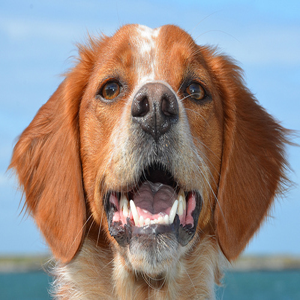
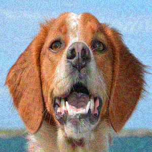
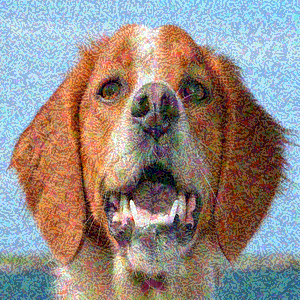
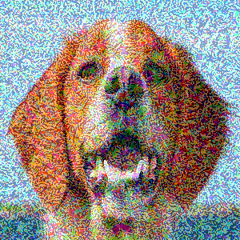

# What You Paint Is What You Get
Anonymous Author 1, Anonymous Author 2

## The Painting Affect
###### Painting vs adversarial perturbations generated using PGD<sub>10</sub> attack.<br> - The dog can be identified after few strokes.<br> - The greater the 𝜀, the earlier the perturbations become perceptible.
|               |                                        𝜀 = 0                                        |                                       𝜀 = 12                                        |                                        𝜀 = 24                                        |                                        𝜀 = 36                                        |                                        𝜀 = 51                                        |
|---------------|:------------------------------------------------------------------------------------:|:------------------------------------------------------------------------------------:|:-------------------------------------------------------------------------------------:|:-------------------------------------------------------------------------------------:|:-------------------------------------------------------------------------------------:|
| Input <br>`∞` |  |  |  |  |  |
| Paint         |      |     |      |      |      |

## Abstract
Despite advances in adversarial training and input transforms, deep networks remain vulnerable to adversarial attacks. We study a defense that couples stroke-based rendering with a decision module trained on classifier confidence trajectories. Our Painter–Classifier–Decisioner (PCLD) framework renders intermediate canvases at increasing stroke counts and lets a lightweight decisioner select the final prediction based on the evolving confidences. We evaluate PCLD under adaptive white-box conditions (BPDA+EOT) and AutoAttack, and run standard sanity checks to avoid gradient-obfuscation pitfalls. In a 7-class ImageNet subset, PCLD improves robustness at moderate to large $\ell_\infty$ budgets while preserving benign accuracy, and shows a transfer from FGSM-based decisioner training to stronger attacks in our setting. We also discuss runtime–accuracy trade-offs and an early-exit design that reduces average latency.


## Install requirements
```
$ pip install -r requirements.txt
```

## Examples
Before running the project, we are highly recommend to experience in [painting a single image](examples%2FPainting.ipynb) and [attack PCLD with a single image](examples%2FPCLD%20BPDA%20Attack%20with%20Single%20Image.ipynb).

## Setup
### Setup 1 (recommended): Download the pretrained models
It is highly recommended to save time and download the entire models folder from [drive](https://drive.google.com/drive/folders/1wydFD78BNzktSY162IYZ5AJMrPE2O43D?usp=drive_link) and save it inside [resources](resources).
####

### Setup 2: Download the pretrained painter and surrogate
**Only if you skipped Setup 1!**
<br>Download the [painter_actor, painter_renderer and train_surrogate_painter folders](https://drive.google.com/drive/folders/1fc92MaQkY5ZzTykcn-TPmnXRb1uEVijI?usp=drive_link) and save it inside resources/models.


## Quick Start 
**(only if you followed Setup 1)**<br>

This section allow you to quickly test our defense with the pre-trained models downloaded in Setup 1.
#### Attack the entire (filtering + adversarial training) model Painter-CLassifier-Decisioner (PCLD) 
With targeted-PGD<sub>10</sub> adaptive attack (𝜀 = {3/255, 9/255})
```
$ python --experiment_type attack_pcld --experiment_suff test_me_pgd10 --dataset subset_of_imagenet --batch_size 10 --output_every 50,100,200,300,400,500,600,700,950,1200,1700,2200,3200,4200,5200 --classifier_experiment train_clf_bp --decisioner_experiment train_decisioner_conv_fgsm --attack pgd --attack_direction targeted --attack_nb_iter 10 --epsilons 3|9
```
It will create a folder (named: "attack_pcld_test_me_pgd10") inside the [results folder](resources%2Fresults).


## Training the Models
**(in case you wish to train it from scratch)**<br>
This section required five steps.
We save you the training of the painter-surrogate models, those models and the painter already exist if you followed the instructions in Setup 2.

#### 1. Paint the benign dataset - generate _B<sub>p_
We will save paints at steps 50,100,200,300,400,500,600,700,950,1200,1700,2200,3200,4200,5200 from each image.
```
$ python --experiment_type paint_dataset --experiment_suff bp --dataset subset_of_imagenet --batch_size 10 --output_every 50,100,200,300,400,500,600,700,950,1200,1700,2200,3200,4200,5200
```
It will create a folder (named: "paint_dataset_bp_subset_of_imagenet") inside the [datasets folder](resources%2Fdatasets).

#### 2. Train a classifier
```
$ python --experiment_type train_classifier --experiment_suff bp --dataset paint_dataset_bp_subset_of_imagenet --batch_size 10 --max_epochs 13 --find_best_epoch 0
```
It will create a folder (named: "train_classifier_bp") inside the [models folder](resources%2Fmodels).

#### 3. Attack PCL
```
$ python --experiment_type attack_pcl --experiment_suff bp_fgsm_untargeted --dataset subset_of_imagenet --batch_size 10 --output_every 50,100,200,300,400,500,600,700,950,1200,1700,2200,3200,4200,5200 --classifier_experiment train_classifier_bp --attack fgsm --attack_direction untargeted --attack_train 1 --epsilons 0|3|6|9|12
```
It will create a folder (named: "attack_pcl_bp_fgsm_untargeted") inside the [results folder](resources%2Fresults).

#### 4. Train a decisionr
```
$ python --experiment_type train_decisioner --experiment_suff conv_fgsm_untargeted --dataset attack_pcl_bp_fgsm_untargeted --batch_size 10 --output_every 50,100,200,300,400,500,600,700,950,1200,1700,2200,3200,4200,5200 --decisioner_architechture conv
```
It will create a folder (named: "train_decisioner_conv_fgsm_untargeted") inside the [models folder](resources%2Fmodels).

#### 5. Attack PCLD
```
$ python --experiment_type attack_pcld --experiment_suff pgd10_targeted --dataset subset_of_imagenet --batch_size 10 --output_every 50,100,200,300,400,500,600,700,950,1200,1700,2200,3200,4200,5200 --classifier_experiment train_classifier_bp --decisioner_experiment train_decisioner_conv_fgsm_untargeted --attack pgd --attack_direction targeted --attack_nb_iter 10 --epsilons 4|8
```
It will create a folder (named: "attack_pcld_pgd10_targeted") inside the [models folder](resources%2Fmodels).

