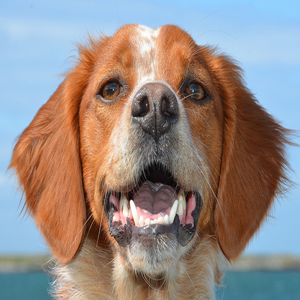
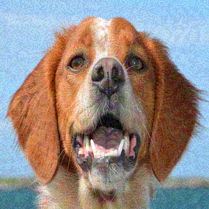
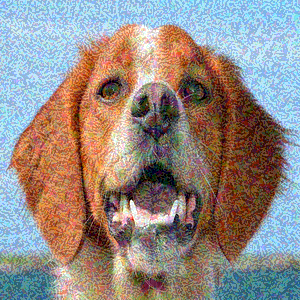
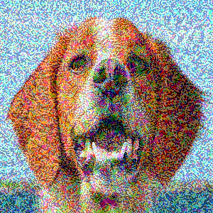

# Drawing as Adversarial Manipulation Filter
Anonymous Author 1, Anonymous Author 2

## Abstract
Machine learning in general and computer vision models in particular are vulnerable to adversarial manipulation. Adversarial training and input transformations are two of the most prominent techniques for building adversary-resilient models. However, adversarial training faces challenges generalizing to unseen attacks and data, particularly in high-dimensional environments, while input transformations are ineffective against large perturbations. Notably, good painting algorithms attempt to capture the essential visual elements of an image. Thereby we find them to be effective filters of adversarial perturbations. We observe that the painting granularity and the magnitude of perturbations required to produce an adversarial effect are correlated. This observation is used for adversarial training of an ensemble classifier that collates classification probabilities from multiple painting steps. This approach robustly addresses substantial perturbations and demonstrates generalizability across multiple attack methods.
|                       |                                        𝜀 = 0                                        |                                       𝜀 = 12                                        |                                        𝜀 = 24                                        |                                        𝜀 = 36                                        |                                        𝜀 = 51                                        |
|-----------------------|:------------------------------------------------------------------------------------:|:------------------------------------------------------------------------------------:|:-------------------------------------------------------------------------------------:|:-------------------------------------------------------------------------------------:|:-------------------------------------------------------------------------------------:|
| Input Image (`t = ∞`) |  |  |  |  |  |
| Painting              |      |     |      |      |      |

Figure 1. Painting vs adversarial perturbations generated using FGSM attack.


## Install requirements
```
$ pip install -r requirements.txt
```
(You may consider creating venv and install requirements inside)

## Setup
### Setup 1: Download the dataset
#### You can use the exact dataset described in the paper by running the [notebook](./setup_1_subset_of_imagenet_downloader/Get Subset of ImageNet we Used in Paper.ipynb). This will create a new dataset in [subset_of_imagenet](./resources/datasets/subset_of_imagenet) folder and a small sample in [subset_of_imagenet_sample](./resources/datasets/subset_of_imagenet_sample) folder.
####

### Setup 2: Download the pretrained painter
#### To be able to generate paints given an image you should download the pretrained actor and renderer models from [here](https://drive.google.com/drive/folders/1ejwPwR-WCBJgjGXisjTplHFFREo0itGB), and save them inside [LearningToPaint](./LearningToPaint) folder.
####


## Training PCL<sub>2</sub>D victim model 
(the 2 in PCL<sub>2</sub>D represents training the classifier CL on both, the benign dataset and the paints generated from the benign deataset)
### 1. Generate paints from the benign dataset
```
$ python --experiment_type defend_drawing_agent --experiment_name PCLD --ds_local_path ./resources/datasets/subset_of_imagenet --save_every "200,700,1200,1700,2200,2700,3200,3700,4200,4700,5200" 
```
This will create a new folder with paints and the original benign dataset together, named [subset_of_imagenet_paints](./resources/datasets/subset_of_imagenet_paints).

### 2. Training CL<sub>2</sub> victim classifier (trained on paints and benign images)
```
$ python --experiment_type train_victim_clf --experiment_name PCLD --ds_local_path ./resources/datasets/subset_of_imagenet_paints --batch_size 128 --lr 0.01 --n_epochs 30
```
You can skip this step and download the classifier we already trained on this dataset from [here](https://drive.google.com/drive/folders/1ejwPwR-WCBJgjGXisjTplHFFREo0itGB).

### 3. Training surrogate to mimic PCL<sub>2</sub> victim model
```
$ python --experiment_type train_surrogate_for_victim_clf --experiment_name PCLD --ds_local_path ./resources/datasets/subset_of_imagenet --batch_size 128 --lr 0.01 --n_epochs 50 --net_victim_local_dir ./resources/models/train_victim_clf_PCLD --ds_victim_local_path ./resources/datasets/subset_of_imagenet_paints
```
You can skip this step and download the surrogate we already trained on the benign dataset from [here](https://drive.google.com/drive/folders/1ejwPwR-WCBJgjGXisjTplHFFREo0itGB).


### 4. Generate attacks using the surrogate
```
$ python --experiment_type attack_surrogate_for_victim_clf --experiment_name PCLD --ds_local_path ./resources/datasets/subset_of_imagenet --attack fgsm --batch_size 128 --epsilons 0|3|6|9|12|15|18|21|24|27|30|33|36|39|42|45|48|51 --net_surrogate_local_dir ./resources/models/train_surrogate_for_victim_clf_PCLD --net_victim_local_dir ./resources/models/train_victim_clf_PCLD
```
Note that if you downloaded victim and/or surrogates models, you should replace the `net_surrogate_local_dir` and `net_victim_local_dir` parameters to the dirs where you saved them.


### 5. Paint the attacks
```
$ python --experiment_type defend_drawing_agent --experiment_name PCLD --ds_local_path ./resources/datasets/subset_of_imagenet_attack_surrogate_for_victim_clf_PCLD --save_every "200,700,1200,1700,2200,2700,3200,3700,4200,4700,5200" 
```

### 6. Query the classifier CL<sub>2</sub> with the painted (defended) dataset to produce inferences
```
$ python --experiment_type evaluate_victim_clf --experiment_name PCLD --ds_local_path ./resources/datasets/subset_of_imagenet_attack_surrogate_for_victim_clf_PCLD_paints --batch_size 128 --net_victim_local_dir ./resources/models/train_victim_clf_PCLD 
```

### 7. Train a decisioner on the classifier's inferences
```
$ python --experiment_type train_victim_decisioner --experiment_name PCLD --ds_local_path ./resources/results/evaluate_victim_clf_PCLD/results_deep.csv
```
This resulted with PCLD model ready to evaluate.

## Attacking and Evaluating PCLD victim model
### 1. Training surrogate to mimic PCL<sub>2</sub>D victim model
```
$ python --experiment_type train_surrogate_for_victim_decisioner --experiment_name PCLD --ds_local_path ./resources/datasets/subset_of_imagenet --batch_size 128 --lr 0.01 --n_epochs 50 --ds_decisioner_local_path ./resources/models/train_victim_clf_PCLD --ds_victim_local_path ./resources/results/train_victim_decisioner
```

### 2. Generate attacks using the surrogate
FGSM - The attack that the decisioner (and therefore PCLD) trained for
```
$ python --experiment_type attack_surrogate_for_victim_decisioner --experiment_name PCLD --ds_local_path ./resources/datasets/subset_of_imagenet --attack fgsm --batch_size 128 --epsilons 0|3|6|9|12|15|18|21|24|27|30|33|36|39|42|45|48|51 --net_surrogate_local_dir ./resources/models/train_surrogate_for_victim_clf_PCLD --net_victim_local_dir ./resources/models/train_victim_clf_PCLD
```
PGD
```
$ python --experiment_type attack_surrogate_for_victim_decisioner --experiment_name PCLD --ds_local_path ./resources/datasets/subset_of_imagenet --attack pgd --batch_size 128 --epsilons 0|3|6|9|12|15|18|21|24|27|30|33|36|39|42|45|48|51 --net_surrogate_local_dir ./resources/models/train_surrogate_for_victim_clf_PCLD --net_victim_local_dir ./resources/models/train_victim_clf_PCLD
```
DeepFool
```
$ python --experiment_type attack_surrogate_for_victim_decisioner --experiment_name PCLD --ds_local_path ./resources/datasets/subset_of_imagenet --attack deepfool --batch_size 128 --epsilons 0|3|6|9|12|15|18|21|24|27|30|33|36|39|42|45|48|51 --net_surrogate_local_dir ./resources/models/train_surrogate_for_victim_clf_PCLD --net_victim_local_dir ./resources/models/train_victim_clf_PCLD
```

### 3. Paint the attacks
```
$ python --experiment_type defend_drawing_agent --experiment_name PCLD --ds_local_path ./resources/datasets/subset_of_imagenet_attack_surrogate_for_victim_decisioner_PCLD --save_every "200,700,1200,1700,2200,2700,3200,3700,4200,4700,5200" 
```

### 4. Query the classifier CL<sub>2</sub> with the painted (defended) dataset to produce inferences
```
$ python --experiment_type evaluate_victim_clf --experiment_name PCLD --ds_local_path ./resources/datasets/subset_of_imagenet_attack_surrogate_for_victim_decisioner_PCLD_paints --batch_size 128 --net_victim_local_dir ./resources/models/train_victim_clf_PCLD 
```

### 5. Query the decisioner (D) with the classifier's inferences vectors
```
$ python --experiment_type evaluate_victim_decisioner --experiment_name PCLD --ds_local_path ./resources/datasets/subset_of_imagenet_attack_surrogate_for_victim_decisioner_PCLD_paints --model_decisioner_local_path ./resources/models/train_victim_decisioner_PCLD/decisioner_model
```