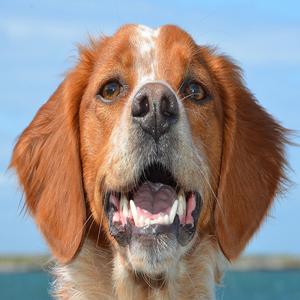
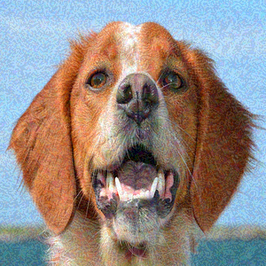
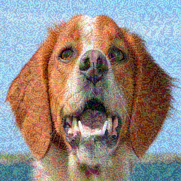
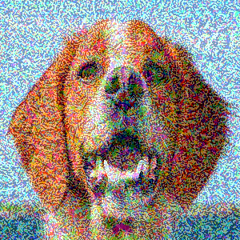
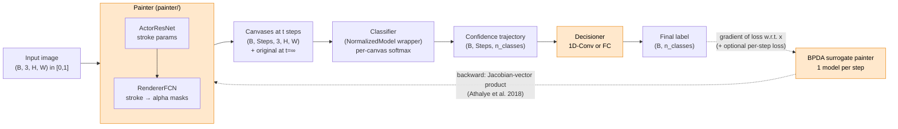
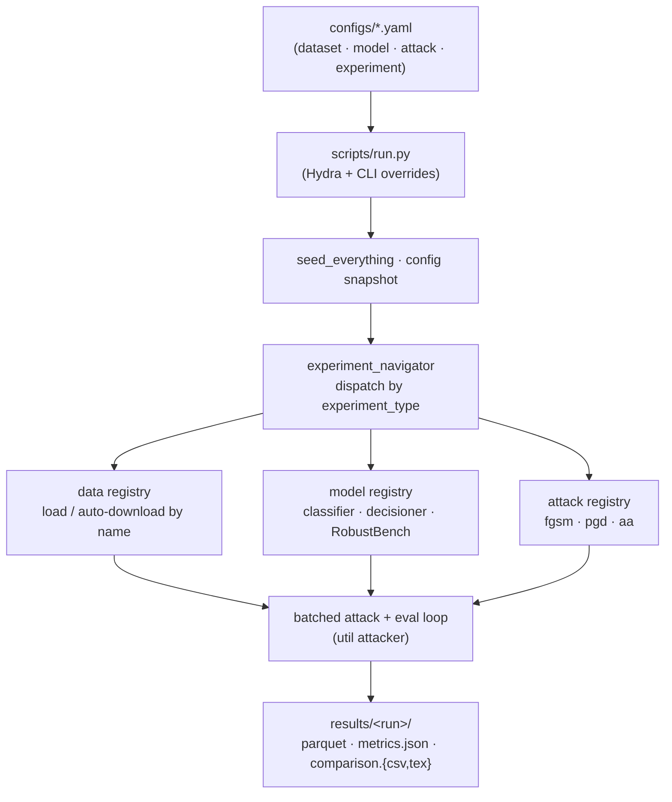
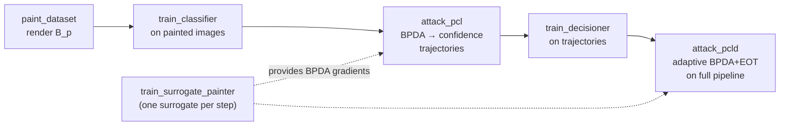

# What You Paint Is What You Get
Anonymous Author 1, Anonymous Author 2

## The Painting Affect
###### Painting vs adversarial perturbations generated using PGD<sub>10</sub> attack.<br> - The dog can be identified after few strokes.<br> - The greater the 𝜀, the earlier the perturbations become perceptible.
|               |                                        𝜀 = 0                                        |                                       𝜀 = 12                                        |                                        𝜀 = 24                                        |                                        𝜀 = 36                                        |                                        𝜀 = 51                                        |
|---------------|:------------------------------------------------------------------------------------:|:------------------------------------------------------------------------------------:|:-------------------------------------------------------------------------------------:|:-------------------------------------------------------------------------------------:|:-------------------------------------------------------------------------------------:|
| Input <br>`∞` |  |  |  |  |  |
| Paint         |      |     |      |      |      |

## Abstract
Despite advances in adversarial training and input transforms, deep networks remain vulnerable to adversarial attacks. We study a defense that couples stroke-based rendering with a decision module trained on classifier confidence trajectories. Our Painter–Classifier–Decisioner (PCLD) framework renders intermediate canvases at increasing stroke counts and lets a lightweight decisioner select the final prediction based on the evolving confidences. We evaluate PCLD under adaptive white-box conditions (BPDA+EOT) and AutoAttack, and run standard sanity checks to avoid gradient-obfuscation pitfalls. In a 7-class ImageNet subset, PCLD improves robustness at moderate to large $\ell_\infty$ budgets while preserving benign accuracy, and shows a transfer from FGSM-based decisioner training to stronger attacks in our setting. We also discuss runtime–accuracy trade-offs and an early-exit design that reduces average latency.

## Architecture

### Defense pipeline (PCLD forward pass)

An input image is rendered by the **Painter** into a stack of canvases at
increasing stroke counts. Every canvas is classified independently, producing a
softmax **confidence trajectory** across paint steps. The **Decisioner** reads
that trajectory and emits the final label. Because the painter is
non-differentiable, adaptive attacks backprop through a **BPDA surrogate**
(one differentiable model per paint step) instead of the real renderer.


```mermaid
flowchart LR
    X["Input image<br/>(B, 3, H, W) in [0,1]"] --> P

    subgraph P["Painter (painter/)"]
        direction TB
        A["ActorResNet<br/>stroke params"] --> R["RendererFCN<br/>stroke → alpha masks"]
    end

    P --> C["Canvases at t steps<br/>(B, Steps, 3, H, W)<br/>+ original at t=∞"]
    C --> CLF["Classifier<br/>(NormalizedModel wrapper)<br/>per-canvas softmax"]
    CLF --> TRAJ["Confidence trajectory<br/>(B, Steps, n_classes)"]
    TRAJ --> DEC["Decisioner<br/>1D-Conv or FC"]
    DEC --> Y["Final label<br/>(B, n_classes)"]

    %% Adaptive-attack gradient path
    SUR["BPDA surrogate painter<br/>1 model per step"] -.->|"backward: Jacobian-vector product<br/>(Athalye et al. 2018)"| P
    Y -.->|"gradient of loss w.r.t. x<br/>(+ optional per-step loss)"| SUR

    classDef novel fill:#ffe8cc,stroke:#e8850c,color:#000;
    class P,SUR,DEC novel;
```

> Orange = the paper's novel contribution (stroke painter, BPDA surrogate,
> decisioner). Classifier and data plumbing are standard components.

**Model wrappers** (`src/pcld/attacks/pcld_bpda.py`): `PCLD` is the full pipeline
used for the adaptive attack; `PCL` is Painter→Classifier only (generates
decisioner training data); `CLD` is Classifier→Decisioner on pre-painted inputs
(naïve baseline); `BPDAPainter` wraps the renderer with the surrogate gradient.

### Experiment framework (config → run → results)

Every experiment is one Hydra config flattened into the arguments the stage
runner consumes, wired to pluggable **registries** for datasets, models, and
attacks. Each run seeds all RNGs, snapshots its config, and writes structured
results.


```mermaid
flowchart TB
    CFG["configs/*.yaml<br/>(dataset · model · attack · experiment)"] --> RUN["scripts/run.py<br/>(Hydra + CLI overrides)"]
    RUN --> SEED["seed_everything · config snapshot"]
    SEED --> NAV["experiment_navigator<br/>dispatch by experiment_type"]

    NAV --> DATA["data registry<br/>load / auto-download by name"]
    NAV --> MODEL["model registry<br/>classifier · decisioner · RobustBench"]
    NAV --> ATK["attack registry<br/>fgsm · pgd · aa"]

    DATA --> EVAL["batched attack + eval loop<br/>(util attacker)"]
    MODEL --> EVAL
    ATK --> EVAL
    EVAL --> OUT["results/&lt;run&gt;/<br/>parquet · metrics.json · comparison.{csv,tex}"]
```

### Five-stage workflow

The defense is trained and evaluated as a chain of `experiment_type` stages,
each runnable from one config:


```mermaid
flowchart LR
    S1["paint_dataset<br/>render B_p"] --> S2["train_classifier<br/>on painted images"]
    S2 --> S3["attack_pcl<br/>BPDA → confidence<br/>trajectories"]
    S3 --> S4["train_decisioner<br/>on trajectories"]
    S4 --> S5["attack_pcld<br/>adaptive BPDA+EOT<br/>on full pipeline"]

    SUR["train_surrogate_painter<br/>(one surrogate per step)"] -.->|"provides BPDA gradients"| S3
    SUR -.-> S5
```

## Requirements & setup

The project is an installable package (`src/pcld`). Create a virtual
environment and install the pinned dependencies:

```bash
# Linux / cluster (CUDA 12.1 torch build)
make setup-cuda           # creates .venv, installs torch 2.5.1 + the package
source .venv/bin/activate

# or CPU-only
make setup && source .venv/bin/activate

# Windows
powershell -ExecutionPolicy Bypass -File scripts\setup_env.ps1 -Cuda
.venv\Scripts\Activate.ps1
```

All dependency versions are pinned in [`pyproject.toml`](pyproject.toml)
(torch/torchvision/robustbench included). Copy [`.env.example`](.env.example)
to `.env` and set the four `RESOURCES_*` paths plus the actor/renderer weight
paths.

### Pretrained models
Download the `models/` folder from
[Drive](https://drive.google.com/drive/folders/1wydFD78BNzktSY162IYZ5AJMrPE2O43D?usp=drive_link)
into your `RESOURCES_MODELS_DIR`, or run `python scripts/download_models.py`
to fetch the painter, surrogates, classifier, and decisioner individually.

## Running experiments (config-driven)

Every experiment is one config, run through Hydra. Any knob can be overridden
on the CLI. Each run writes its resolved config (`config_snapshot.yaml`),
results, and metrics to `RESOURCES_RESULTS_DIR/<experiment_name>/`.

```bash
# Quick end-to-end smoke test (FGSM, a few images)
python scripts/run.py experiment=smoke_test        # or: make smoke

# Paper main experiment: adaptive targeted PGD-10 on the ImageNet subset
python scripts/run.py experiment=paper_pcld_pgd10

# Override anything from the CLI
python scripts/run.py experiment=paper_pcld_pgd10 batch_size=4 attack.epsilons='[4,8]'
```

The example configs live in [`configs/experiment/`](configs/experiment):

| Config | What it runs |
|--------|--------------|
| `smoke_test` | Fast FGSM sanity check; also the behaviour-equivalence config |
| `paper_pcld_pgd10` | Adaptive targeted PGD-10 vs full PCLD, eps {3,9}/255 |
| `rb_sweep` | Attack across a list of RobustBench models → comparison table |

**Cluster runs:** the heavy GPU pipeline (determinism R00, the gradient-masking
gate R01, harness validation R02/R03, and the headline PCLD runs R05–R07) is
scripted step-by-step in [`docs/RUNBOOK.md`](docs/RUNBOOK.md).

### Config layout
```
configs/
  config.yaml            # root; composes the groups below
  dataset/               # subset_of_imagenet, cifar10, ...
  model/                 # pcld_bp, robustbench, ...
  attack/                # pgd, fgsm, aa
  experiment/            # full presets (override any group)
```

Config leaves mirror the old CLI flags 1:1, and `pcld.utils.config` flattens
them into the same argument object the experiment code always used — so the
new interface is behaviour-preserving. The legacy `python main.py --experiment_type ...`
CLI still works.

## Datasets

Loading a registered dataset is one config line (`dataset: cifar10`). CIFAR-10
auto-downloads from HuggingFace on first use; you can also pre-fetch:

```bash
python scripts/data/download.py --dataset cifar10 --splits train test
```

Register a new dataset by adding a builder in
[`src/pcld/data/registry.py`](src/pcld/data/registry.py) with
`@DATASETS.register('name')` — no runner changes.

**Class count is derived from the data.** The classifier head is sized to the
number of class folders in the dataset, so a 7-class ImageNet subset builds a
7-class model and full ImageNet builds 1000. When no dataset is available to
infer from, it falls back to the full size for `dataset_type` (imagenet=1000,
cifar10=10). RobustBench models are the exception — their head is fixed by the
pretrained weights.

## Comparing against RobustBench models

Adding a model to compare against is **one line** in the experiment config's
`comparison.models` list (`name + threat_model + dataset`). The sweep runner
attacks each model and emits a comparison table (CSV + LaTeX):

```bash
python scripts/sweep.py experiment=rb_sweep
# -> RESOURCES_RESULTS_DIR/<name>/comparison.{csv,tex}
```

Model architectures live in the registry at
[`src/pcld/models/registry.py`](src/pcld/models/registry.py) — add a
`ClassifierConfig` entry (see "Adding a New Classifier Architecture" below).

## Metrics & paper tables

`attacker()` writes per-(image × paint-step) rows as Parquet.
[`pcld.eval.metrics`](src/pcld/eval/metrics.py) turns those into
robust-accuracy summaries (`metrics.json`) and comparison tables
(`emit_table` → CSV + LaTeX) ready to drop into the paper.

## Reproducibility

`scripts/run.py` seeds Python/NumPy/PyTorch from `cfg.seed` (set
`deterministic: true` for cuDNN-deterministic kernels) and snapshots the exact
resolved config per run. See [`VERIFICATION.md`](VERIFICATION.md) for the
procedure that proves the refactored pipeline reproduces the pre-refactor
attack output numerically.

## Tests

```bash
pip install pytest && PYTHONPATH=src pytest tests/ -q
```

## Pipeline stages

The full defense is trained and attacked in five stages, each an
`experiment_type` (`paint_dataset` → `train_classifier` → `attack_pcl` →
`train_decisioner` → `attack_pcld`). Set `experiment_type=` and the relevant
config group; see the per-stage flags in
[`src/pcld/utils/integrative.py`](src/pcld/utils/integrative.py).


## Adding a New Classifier Architecture

Classifier architectures are defined in a central registry in
[`src/pcld/models/registry.py`](src/pcld/models/registry.py).  Adding a new model requires editing
**one file** in the common case, and **two files** when introducing a library
that is not yet supported.

---

### Step 1 — Register the model in `src/pcld/models/registry.py`

Open `src/pcld/models/registry.py` and add an entry to `CLASSIFIER_REGISTRY`.

**Example — new Wide ResNet variant (no code change needed):**
```python
'wrn-28-10': ClassifierConfig(
    family='wrn',
    optimizer='sgd',
    weight_decay_imagenet=1e-4,
    weight_decay_cifar10=5e-4,
    wrn_depth=28,
    wrn_width=10,
),
```

**Example — new timm model (no code change needed):**
```python
'vit-b16': ClassifierConfig(
    family='timm',
    optimizer='adamw',
    weight_decay_imagenet=0.05,
    weight_decay_cifar10=0.05,
    timm_name='vit_base_patch16_224',   # any timm model identifier
    timm_pretrained=True,               # load hub weights when no checkpoint given
),
```

Built-in `family` values and what each field controls:

| `family` | Required fields | Optional fields |
|----------|----------------|-----------------|
| `'wrn'`  | `wrn_depth`, `wrn_width` | — |
| `'timm'` | `timm_name` | `timm_pretrained` (default `False`) |

`optimizer` must be `'sgd'` or `'adamw'`.
`weight_decay_imagenet` / `weight_decay_cifar10` are used automatically by
`get_net_and_optim`.

---

### Step 2 (new families only) — Add a build branch in `src/pcld/models/classifier.py`

If your architecture does not come from robustbench or timm, add an
`if cfg.family == ...` branch inside `_build_model()`:

```python
if cfg.family == 'my-library':
    from my_library import MyModel
    return MyModel(num_classes=n_classes)
```

If the new family needs a custom optimizer, add a matching branch in
`_build_optimizer()` as well.

---

### Step 3 — Use it

Pass `--model_type <your-key>` on the CLI:

```
$ python main.py --experiment_type train_classifier \
    --model_type vit-b16 \
    --dataset_type imagenet \
    ...
```

No other files need to change.

